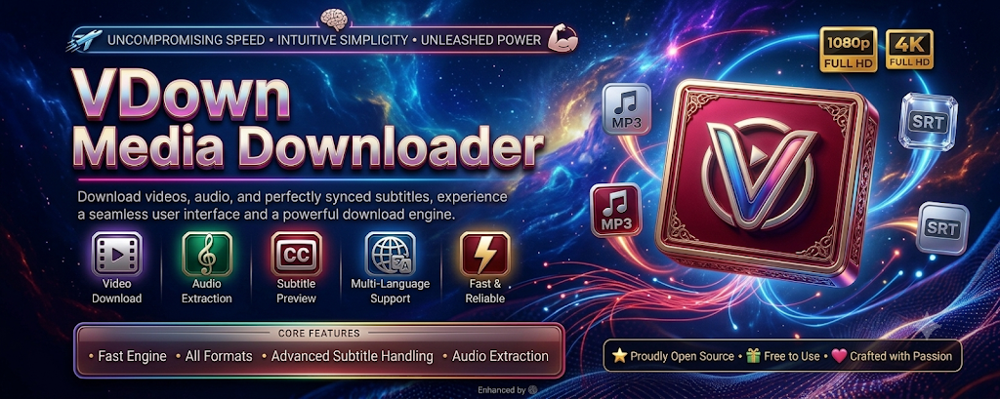
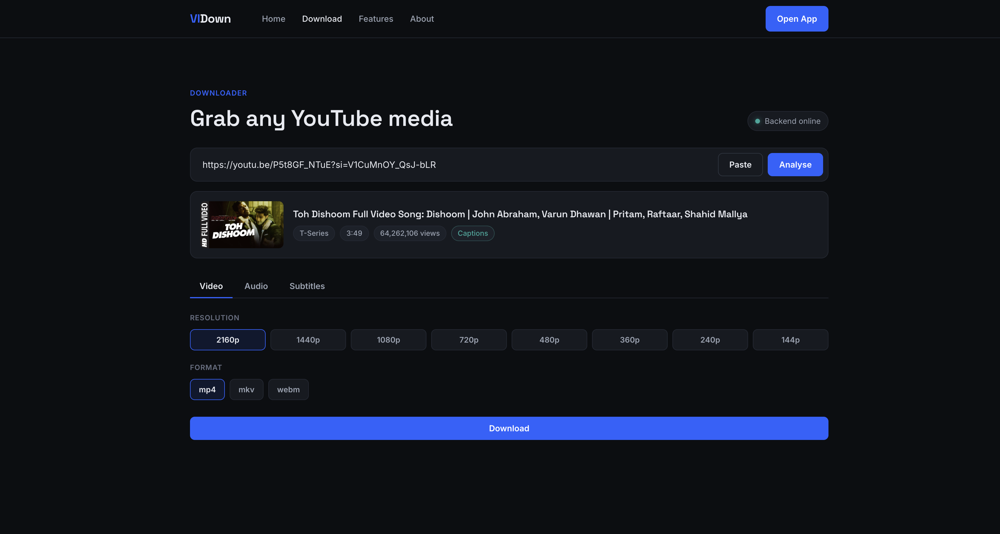
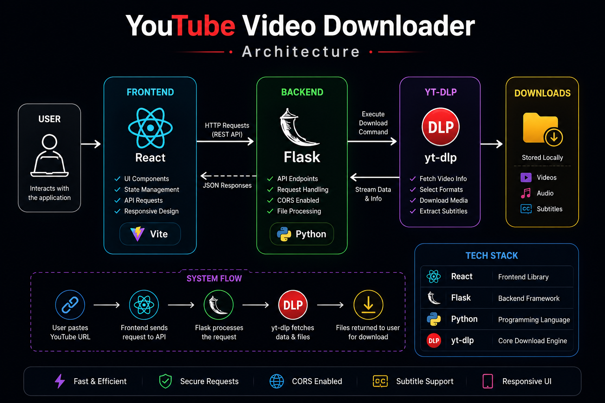

<p align="center">
  
</p>

<p align="center">
  
</p>

<h1 align="center">🎬 YouTube Video Downloader</h1>

<p align="center">
A modern YouTube Video Downloader built with <b>React</b>, <b>Flask</b> and <b>yt-dlp</b>.
<br>
Download Videos, Audio and Subtitles with a clean, fast and responsive interface.
</p>

<p align="center">
  
  
  
  
  
</p>

<p align="center">
⭐ If you like this project, don't forget to leave a star!
</p>

---

# 🚀 Features

- 🎥 Download YouTube Videos
- 🎵 Extract High Quality Audio
- 📝 Subtitle Preview
- 🌍 Multi-language Subtitle Support
- ⚡ Fast Download Processing
- 🌙 Modern Dark UI
- 📱 Responsive Design
- 🔥 React + Flask Architecture
- 🚀 Powered by yt-dlp

---

# 🎥 Demo

<p align="center">

</p>

---

# 📸 Application Preview

<p align="center">

</p>

---

# 🏗️ Architecture

<p align="center">

</p>

---

# 🛠️ Tech Stack

| Frontend | Backend | Download Engine |
|----------|----------|----------------|
| React | Flask | yt-dlp |
| Vite | Flask-CORS | Python |

---

# 📂 Project Structure

```text
Youtube-Video-Downloader
│
├── assets/
│   ├── banner.png
│   ├── logo.jpg
│   ├── demo.gif
│   ├── home.png
│   ├── architecture.png
│   └── social-preview.png
│
├── frontend/
├── server.py
├── requirements.txt
└── README.md
```

---

# ⚙️ Installation

### Clone

```bash
git clone https://github.com/Abhishek09821/Youtube-Video-Downloader.git
```

### Backend

```bash
pip install -r requirements.txt

python server.py
```

### Frontend

```bash
cd frontend

npm install

cp .env.example .env

npm run dev
```

---

# 🌐 Environment Variable

```env
VITE_API_BASE=http://localhost:8080
```

---

# ⭐ Why this project?

- Beautiful Dark Interface
- Fast Downloads
- Audio & Subtitle Support
- Lightweight Flask Backend
- Easy Deployment
- Open Source

---

# 🗺️ Roadmap

- ✅ Video Download
- ✅ Audio Download
- ✅ Subtitle Preview
- 🔜 Playlist Support
- 🔜 Download Queue
- 🔜 Docker Support

---

# 🤝 Contributing

Contributions are welcome!

1. Fork this repository
2. Create your branch
3. Commit your changes
4. Push your branch
5. Open a Pull Request

---

# 📄 License

Apache 2.0 License

---

<div align="center">

## ⭐ Star this Repository

Made with ❤️ by **Abhishek**

</div>